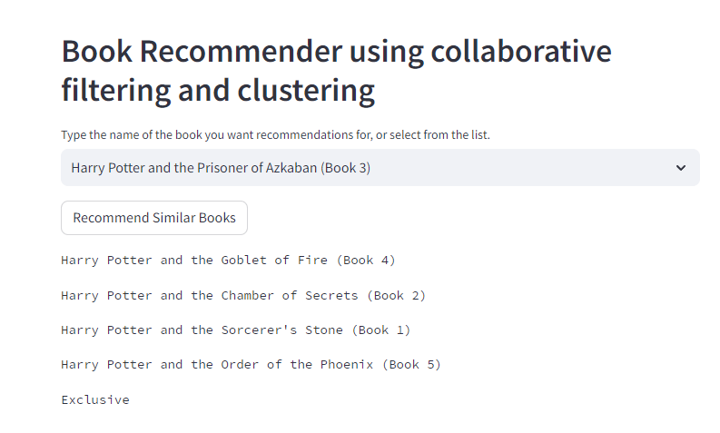

# Recommendation-System

A Python web app using Streamlit which offers book recommendations by employing collaborative filtering and clustering. The app uses the books dataset from Kaggle, which consists of a dataset of books, a dataset of users, and a dataset of user ratings on books. The clustering model used is a nearest neighbours algorithm, retrieving the book's 5 nearest neighbours in terms of similarity distance.

Similarity between books is based on which users have similar interests (i.e. give similar ratings to a given book).

## Installation

```
git clone https://github.com/takavor/Recommendation-System.git
cd Recommendation-System
pip install -r requirements.txt
streamlit run app.py
```

## Snapshot of the app


